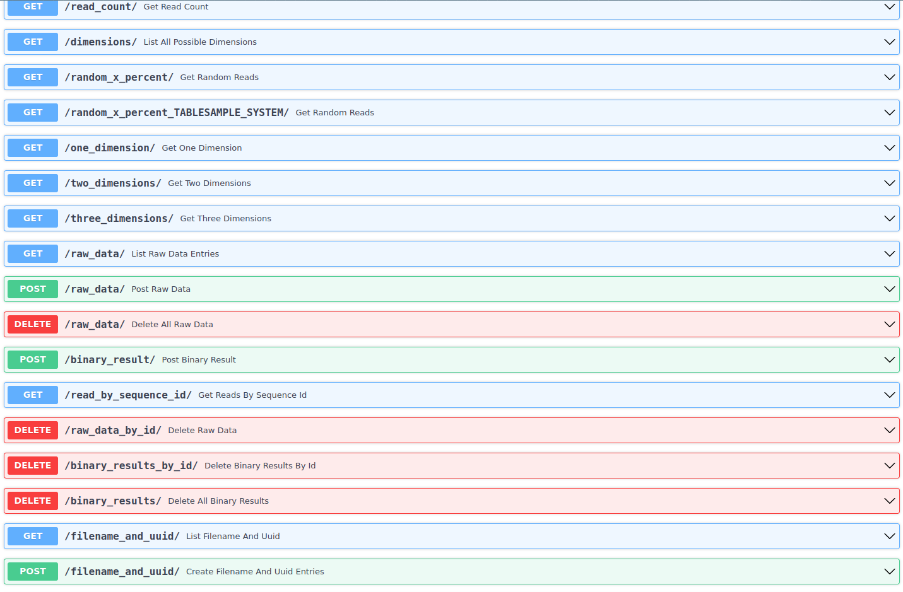
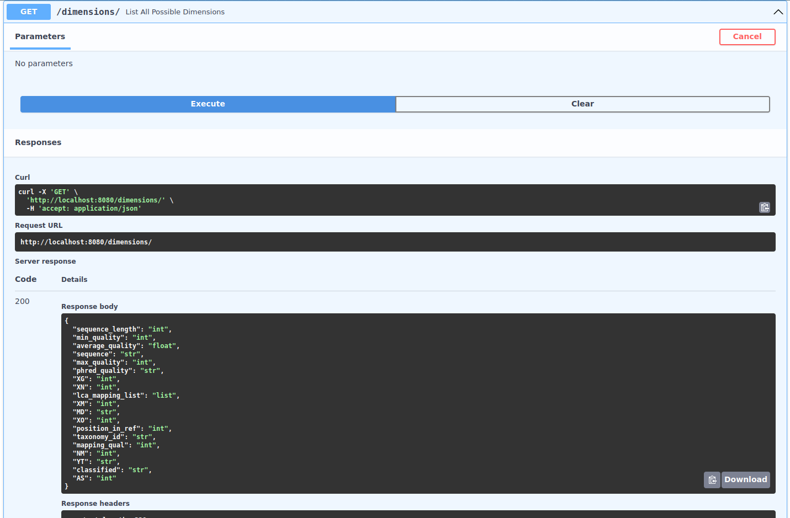
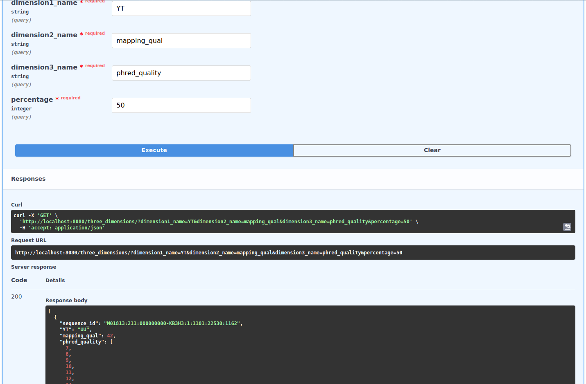

# DatabaseAPI1
## Postgres2-Prototyp
Python API that reads .fastq and .sam files into three separate tables in a PostgreSQL DB.
Current ERD: 


to start:  
1. run ``pip install -r requirements.txt``
2. start postgresql
3. run ```alembic revision --autogenerate -m "New Migration"```
4. ```alembic upgrade head```
5. ```uvicorn main:app --reload --port 8080```

6. now with added get dimensions endpoints.

7. please keep in mind, that "phred_quality is saved as "string" here, 
but is returned as list of ints in the actual endpoints
