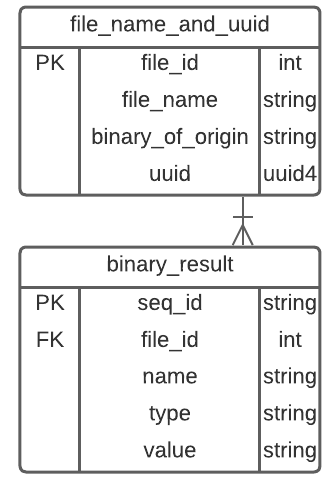
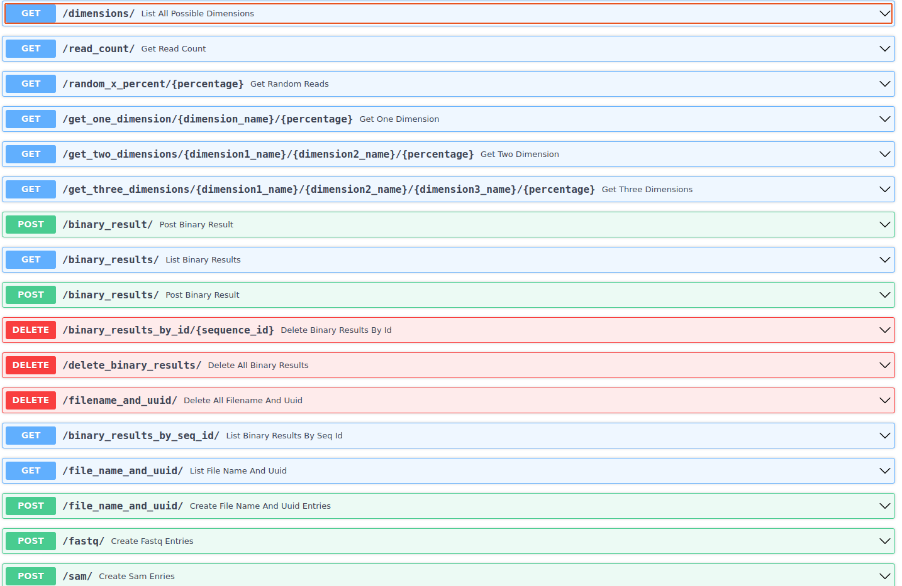
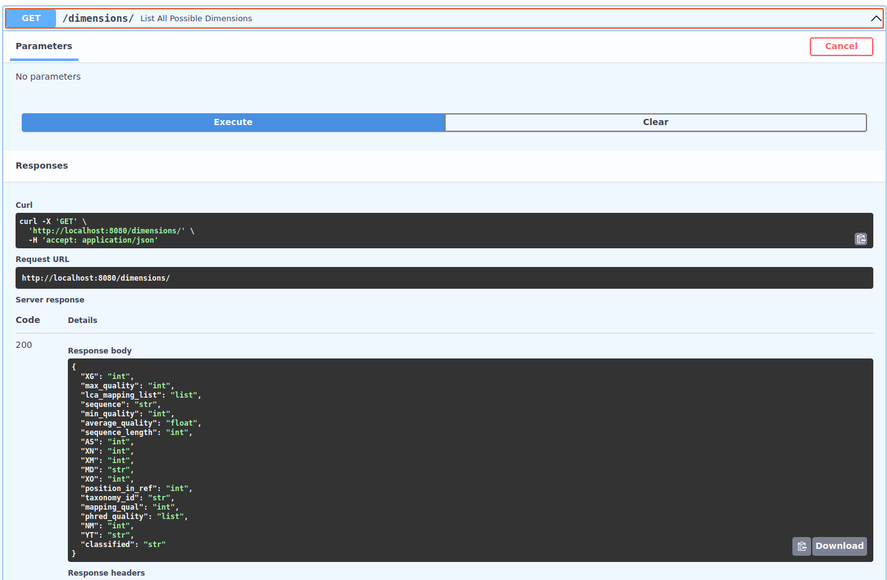
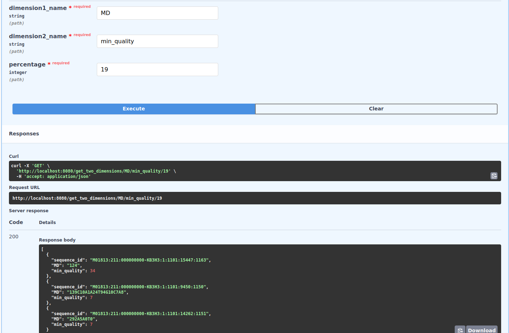

# DatabaseAPI1
##Postgres1_Prototyp  
Python API that reads .fastq and .sam as well as krakenOutput.txt files into a simplified PostgreSQL DB.
original file name is saved in file_name_and_uuid table, all reads/aligments/classification "data-points" are split up into seperate
"binary-results" and saved in respective table.
Current ERD: 


to start: 
1. run ``pip install -r requirements.txt``
2. start postgresql
3. run ```alembic revision --autogenerate -m "New Migration"```
4. ```alembic upgrade head```
5. ```uvicorn main:app --reload --port 8080```



