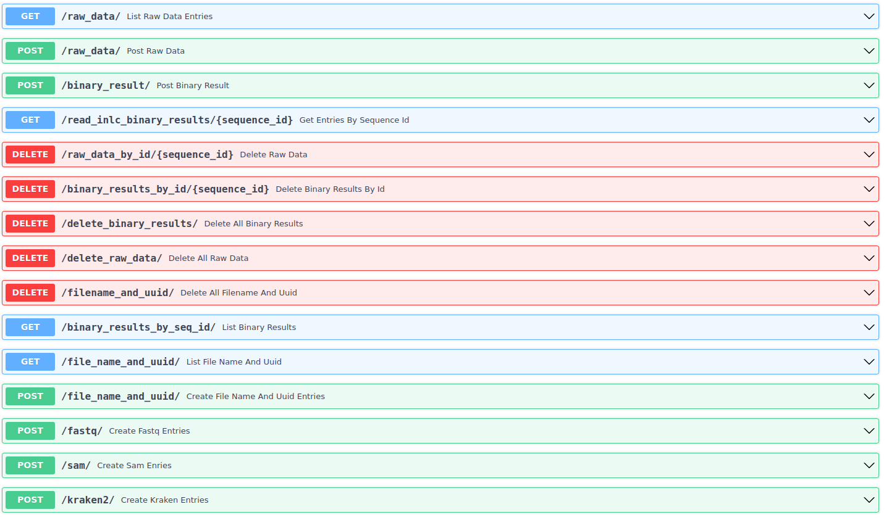

# DatabaseAPI1
Python API that reads .fastq and .sam files into three separate tables in a PostgreSQL DB.
Current ERD: 


to start:  
1. start postgresql
2. run ```alembic revision --autogenerate -m "New Migration"```
3. ```alembic upgrade head```
4. ```uvicorn main:app --reload --port 8080```

5. now with added get dimensions endpoints, but the returned response models are not good.