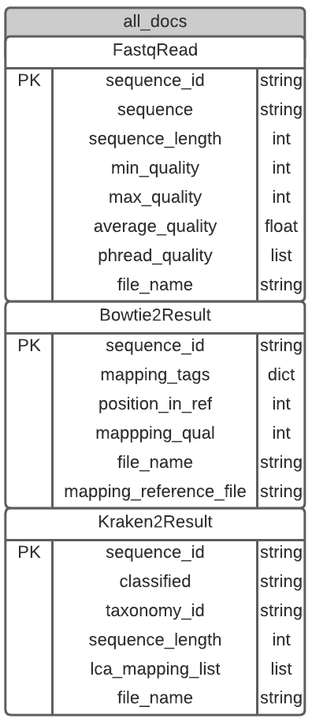

# DatabaseAPI1
Python API that reads .fastq reads , bowtie2 aligments or kraken2 classifiactions into a Mongo-DB flatfile database. The database accepts all different documents into one single collection. however, for every new data/file format a new model, schema and endpoint has to be implemented.
Current ERD: 


to start:  
1. start mongoDB
2. ```uvicorn main:app --reload --port 8080```