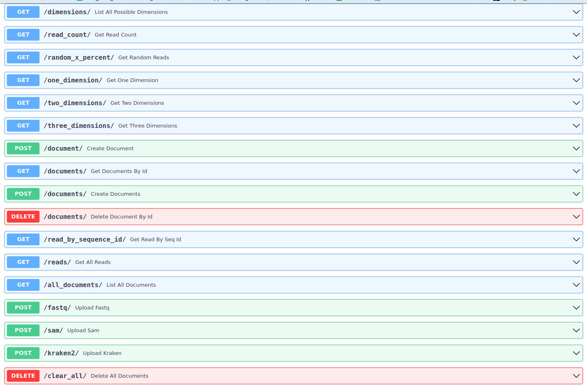
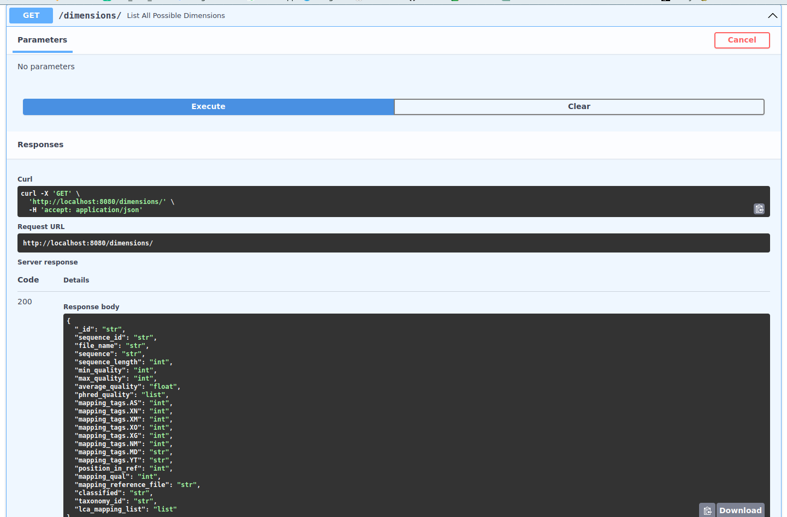
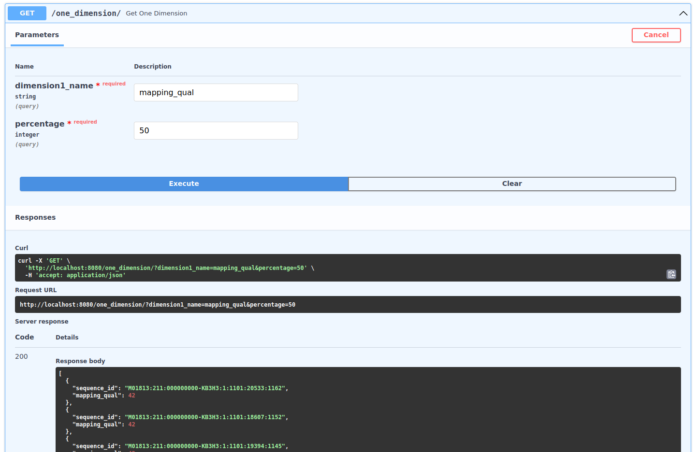

# DatabaseAPI1
## MangoDB1 Prototyp
Python API that reads .fastq reads , bowtie2 aligments or kraken2 classifiactions as seperate documents into Mongo-DB. 
The database accepts all different documents into one single collection. however, 
for every new data/file format a new model, schema and endpoint has to be implemented.
Current ERD: 


to start:  
1. ``pip install -r requirements.txt```
2. start your local MongoDB
3. ```uvicorn main:app --reload --port 8080```


