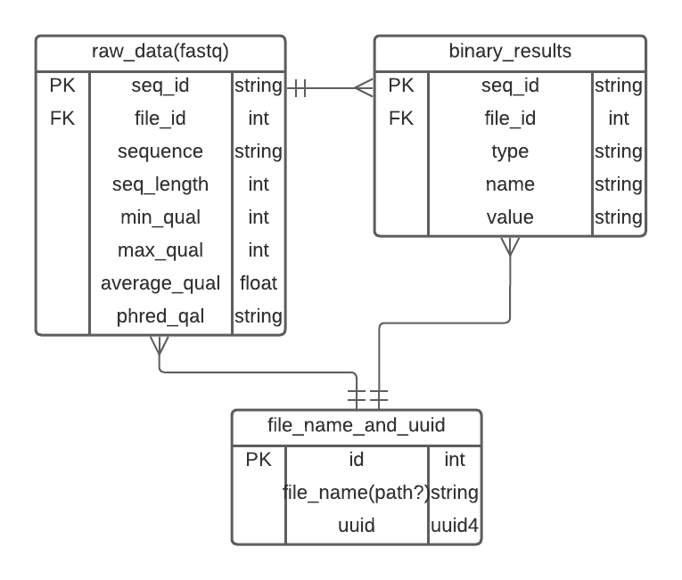

# DatabaseAPI1
Python API that reads .fastq and .sam files into a PostgreSQL DB.
Current ERD: 


to start:  
1. start postgresql
2. run ```alembic init alembic```
3. ```alembic revision --autogenerate -m "New Migration"```
4. ```uvicorn main:app --reload```